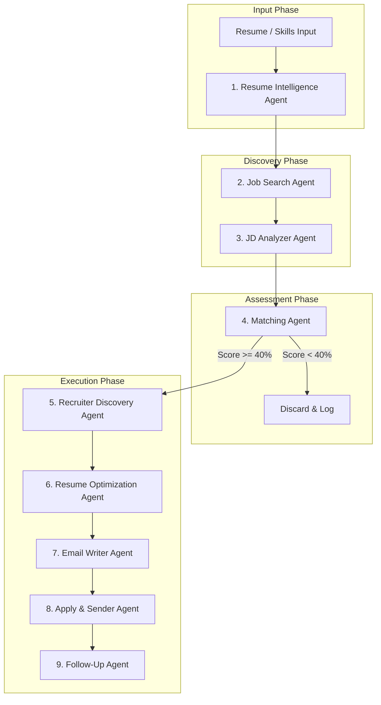
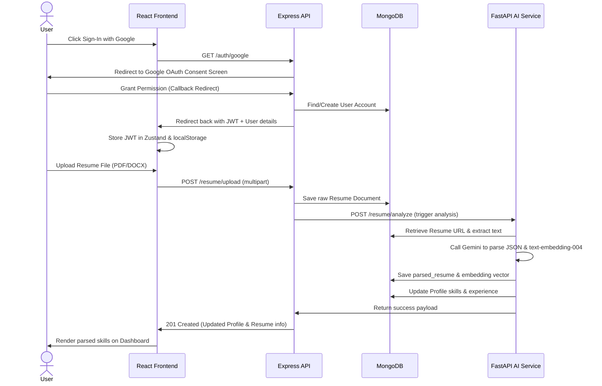
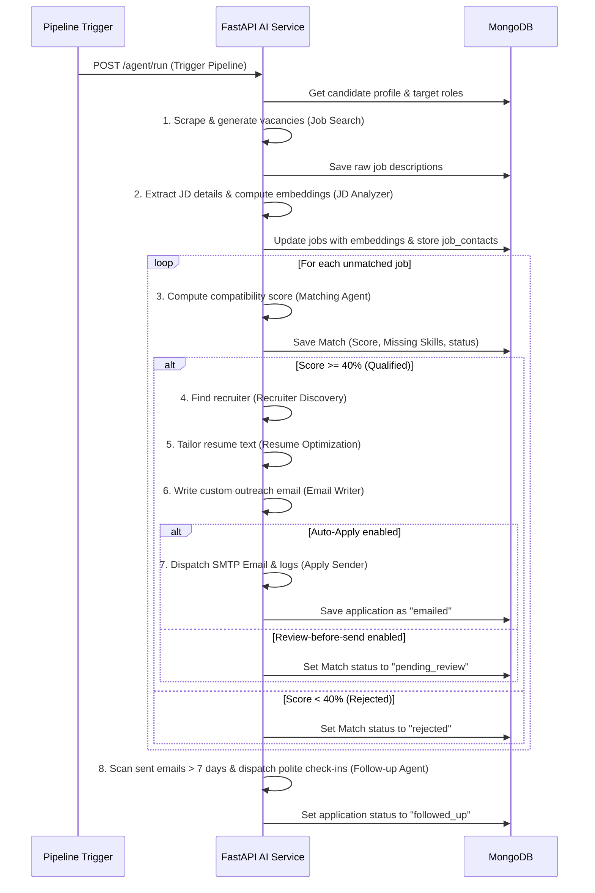

# ApplyAI — Autonomous Job Application Agent SaaS

> **Motto**: *"Spend less time applying, more time preparing."*
> 
> ApplyAI is a fully autonomous, production-ready career search engine and outreach coordinator. It bridges the gap between your qualifications and the job market by automating the entire job hunt lifecycle—crawling vacancies, scoring matching JD metrics, optimizing resumes truthfully, extracting recruiter contacts, and sending tailored, context-aware applications.

---

## System Architecture

ApplyAI is built as a modular, high-performance monorepo:

```
                  ┌───────────────────────────────┐
                  │        React Frontend         │
                  │   Vite + Tailwind + Zustand   │
                  │          Port: 5173           │
                  └───────────────┬───────────────┘
                                  │ (HTTP Proxy /api)
                                  ▼
                  ┌───────────────────────────────┐
                  │      Express API Server       │
                  │     Node.js + JWT + Mongo     │
                  │          Port: 5001           │
                  └───────────────┬───────────────┘
                                  │ (Axios Calls)
                                  ▼
                  ┌───────────────────────────────┐
                  │      FastAPI AI Service       │
                  │   LangGraph Multi-Agent RAG   │
                  │          Port: 8000           │
                  └───────────────┬───────────────┘
                                  │
         ┌────────────────────────┴────────────────────────┐
         ▼                                                 ▼
┌──────────────────┐                              ┌──────────────────┐
│  MongoDB Atlas   │                              │   Gemini APIs    │
│  Vector Index    │                              │  Generative/Embed│
└──────────────────┘                              └──────────────────┘
```

---

## Directory Structure

```
JOB-SCRAPER/
├── frontend/                   # React Client Application
│   ├── public/                 # Static assets
│   ├── src/
│   │   ├── api/                # Axios API client (intercepts JWT)
│   │   │   └── client.js
│   │   ├── components/         # Reusable widgets
│   │   │   ├── layout/         # Header/Navbar
│   │   │   └── ui/             # Card, Badge, Button, Input
│   │   ├── lib/                # Tailwind CSS utils
│   │   ├── pages/              # Page views
│   │   │   ├── DashboardPage.jsx # Core SaaS panel (matches, settings, logs)
│   │   │   ├── LandingPage.jsx   # Landing hero page
│   │   │   ├── LoginPage.jsx     # Google & Credentials Sign-In
│   │   │   └── RegisterPage.jsx  # Sign-up & Google Register
│   │   ├── store/              # Zustand auth states
│   │   ├── App.jsx             # React Routes config
│   │   └── index.css           # Tailwind CSS directives & theme extensions
│   ├── package.json
│   └── vite.config.js          # Proxies /api -> Express server (Port 5001)
│
├── server/                     # Node.js Express API Gateway
│   ├── uploads/                # Directory for resume uploads
│   ├── src/
│   │   ├── config/             # MongoDB database client
│   │   ├── middleware/         # JWT verification & Error handlers
│   │   ├── models/             # Mongoose schemas (explicitly collection-mapped)
│   │   │   ├── User.js         # User credentials table
│   │   │   ├── Profile.js      # Skills, target roles & agent settings
│   │   │   ├── Resume.js       # Raw & parsed resume schemas
│   │   │   ├── Job.js          # Scraped vacancies
│   │   │   ├── JobContact.js   # HR contact details
│   │   │   ├── Match.js        # Match scores & decision tracking
│   │   │   ├── GeneratedResume.js # Custom tailored resumes
│   │   │   ├── GeneratedEmail.js  # Tailored outreach templates
│   │   │   ├── SentEmail.js       # Tracking direct dispatches
│   │   │   ├── Application.js     # Master applications tracking
│   │   │   └── AgentLog.js        # Terminal action logs
│   │   ├── routes/             # Authentication & pipeline routers
│   │   └── index.js            # Express server entry point (Port 5001)
│   ├── package.json
│   └── verify_pipeline.js      # Integration test runner
│
├── ai-service/                 # Python FastAPI AI Service
│   ├── app/
│   │   ├── config.py           # Pydantic environment configurations
│   │   ├── database.py         # Async Motor MongoDB connection
│   │   ├── agents/             # The 9 autonomous agents
│   │   │   ├── resume_intelligence.py
│   │   │   ├── job_search.py
│   │   │   ├── jd_analyzer.py
│   │   │   ├── matching.py
│   │   │   ├── recruiter_discovery.py
│   │   │   ├── resume_optimization.py
│   │   │   ├── email_writer.py
│   │   │   ├── apply_sender.py
│   │   │   └── follow_up.py
│   │   ├── graph/              # LangGraph Supervisor state machine
│   │   │   └── supervisor.py
│   │   └── routes/             # FastAPI HTTP endpoints mapping to agents
│   ├── main.py                 # FastAPI uvicorn start endpoint (Port 8000)
│   ├── requirements.txt        # Python dependency manifest
│   └── venv/                   # Python virtual environment
│
├── docker-compose.yml          # Local MongoDB Docker runner
├── DEPLOYMENT.md               # Production setup instructions
└── README.md                   # Documentation report (this file)
```

---

## Detailed AI Agents Explanation

The core operations of ApplyAI are driven by a multi-agent team. Each agent performs a specific role, utilizing API integrations and cloud services.



### 1. Resume Intelligence Agent
* **Purpose**: Parse raw, unformatted resume uploads (PDF/DOCX) or manual input into structural data, generating query vectors.
* **Mechanism**:
  * Extracts text from PDF via `PyMuPDF` (`fitz`) and Word via `python-docx`.
  * Passes text to Gemini API (`gemini-2.5-flash` in JSON Mode) to map raw strings to a clean JSON structure: `name`, `skills`, `projects`, `education`, `experience`, `achievements`.
  * Generates a 768-dimension vector embedding of the candidate profile using **Gemini Embeddings API (`text-embedding-004`)**.
  * Saves parsed data and vector array to `resumes` and updates `profiles`.

### 2. Job Search Agent
* **Purpose**: Crawl the web based on the candidate's target roles and location preferences to collect new job opportunities.
* **Mechanism**:
  * Crawls company career pages or boards using `BeautifulSoup` and `playwright`.
  * Generates high-fidelity simulated job listings via Gemini API matching the target query parameters to seed the database during testing.
  * Stores raw job information in the `jobs` collection.

### 3. JD Analyzer Agent
* **Purpose**: Parse messy raw job descriptions, identifying key qualifications and contact information.
* **Mechanism**:
  * Calls Gemini API in JSON Mode to extract required skills, experience level, responsibilities, and instructions.
  * Scans for emails using NLP and Regex, immediately writing discovered contacts to `job_contacts`.
  * Encodes the processed JD details using Gemini `text-embedding-004` to create a `jobs.embedding` vector.

### 4. Matching Agent
* **Purpose**: Compute mathematical compatibility scores between the candidate's profile and the vacancy, enforcing the 40% action threshold.
* **Mechanism**:
  * Loads `resumes.embedding` and `jobs.embedding` from MongoDB.
  * Computes cosine similarity in pure Python (avoiding compilation dependencies) to yield a **Semantic Score (40%)**.
  * Measures **Skill Overlap (30%)** (candidate skills vs job requirements).
  * Evaluates **Experience Fit (20%)** (comparing parsed years of experience).
  * Evaluates **Location Fit (10%)** (remote preferences).
  * Logs the total compatibility percentage to `matches`. If score $\ge 40\%$ (configurable), it proceeds.

### 5. Recruiter Discovery Agent
* **Purpose**: Find a valid corporate recipient email address for the candidate's outreach.
* **Mechanism**:
  * Inspects `job_contacts` first. If missing, crawls the target company's domains and careers pages using `playwright` looking for mailto links.
  * Synthesizes fallback addresses (e.g. `careers@company.com`, `hr@company.com`) with a lower confidence rating if no direct email is found.

### 6. Resume Optimization Agent
* **Purpose**: Personalize bullet points and highlight skills relevant to the specific job.
* **Mechanism**:
  * Prompts Gemini to reword description fields and emphasize keyword matches.
  * **Strict Constraint**: System instructions strictly forbid fabricating any job experience, company, technologies, or dates.
  * Writes the tailored markdown to the `generated_resumes` collection.

### 7. Email Writer Agent
* **Purpose**: Compose a unique, situation-specific outreach pitch for each application.
* **Mechanism**:
  * Uses Gemini API to write a tailored email (under 150 words) based on candidate metadata and the job description.
  * Tone adapts dynamically: friendly and direct if a recruiter's name was found, vs. formal and structured if sending to a generic address.
  * Saves to `generated_emails`.

### 8. Apply & Sender Agent
* **Purpose**: Dispatch the application.
* **Mechanism**:
  * Checks `profiles.preferences.review_before_send`.
  * If `true`, pauses the flow, sets status to `pending_review`, and awaits manual dashboard approval.
  * If `false`, dispatches the email via SMTP (`smtplib`), falls back to a dry-run mock transmission if SMTP is unconfigured, and creates `applications` and `sent_emails` records.

### 9. Follow-Up Agent
* **Purpose**: Monitor submitted applications and check in automatically if recruiters do not reply.
* **Mechanism**:
  * Scrapes applications in the `emailed` status that are older than `follow_up_days` (default: 7).
  * Prompts Gemini to draft a concise follow-up email.
  * Sends the email via SMTP and sets the status to `followed_up`.

---

## User Flow Diagrams

### 1. User Onboarding & Profile Creation


### 2. Autonomous Agent Execution Loop


---

## Production Setup & Deployment

Refer to **[DEPLOYMENT.md](file:///c:/JOB-SCRAPER/DEPLOYMENT.md)** for details on configuring production environments:
* **Database**: Set up a MongoDB Atlas cluster and configure vector search indexes.
* **AI Service (FastAPI)**: Deploy to Render or Railway with Python runtime, linking your `GEMINI_API_KEY`.
* **Express API Server**: Deploy to Render, mapping `PORT=5001` and connecting to MongoDB.
* **Frontend**: Deploy Vite static bundle to Vercel, pointing `VITE_API_URL` to your Express domain.
